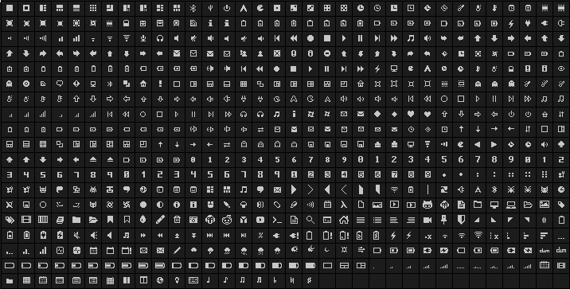

# Siji

Siji is an iconic bitmap font based on the Stlarch font with additional glyphs.

It inherits additional glyphs from Sm4tik xbm icon pack, Lokaltog Symbols font, xbm-icon font, Uushi font, FontAwesome, and Tewi font with personal additions.

Siji is built on top of Stlarch, so your existing stlarch unicode values will **just work**.

Siji is a **Work In Progress**, so more glyphs will be added over the time.



## What's the difference between Stlarch and Siji ?

- Siji comes with **215 new glyphs**, selectively ported from other fonts and xbm icons with personal additions.
- Increased letter spacing.
- Properly centered glyphs.

## Installation

### Arch Linux

[PKGBUILD](https://aur.archlinux.org/packages/siji-git) by [brandon99](https://github.com/brandon099)

### CRUX

[CRUX port](http://dl.z3bra.org/crux/v3.2/siji-font/) by [z3bra](http://z3bra.org/)

### Others

Clone this repo and `cd` into the siji directory:

```sh
git clone https://github.com/stark/siji && cd siji
```

Then run the installer script with `./install.sh`.

By default Siji will be installed in your `$HOME/.fonts` directory, it will be created if the directory is non-existent.

If you wish to install Siji in another directory then run the `install.sh` script with the `-d` flag and specify the font directory as an argument.

**Example:**

```sh
./install.sh -d ~/.fonts
```

## How to get the glyph codes ?

Install `xfd`:

### Arch Linux
```
sudo pacman -S xorg-xfd
```

### Debian
```
sudo apt-get install x11-utils
```

### Fedora
```
sudo dnf install xorg-x11-apps
```

After installing `xfd` run the `view.sh` script:

```sh
./view.sh
```

## Using Siji with other programs:

As long as the program allows to set a fallback font, Siji will work.

Examples of using Siji with some programs:

### Dwm

```C
static const char font[] = "-wuncon-siji-medium-r-normal--10-100-75-75-c-80-iso10646-1" ","  /* For Iconic Glyphs */
                           "-*-tamsyn-medium-r-normal-*-12-*-*-*-*-*-*-1";                   /* For Normal Text */
```

### Dmenu

```sh
dmenu -fn '-*-tamsyn-medium-r-normal-*-12-*-*-*-*-*-*-1','-wuncon-siji-medium-r-normal--10-100-75-75-c-80-iso10646-1'
```

### Lemonbar

```sh
lemonbar -p -f '-*-tamsyn-medium-r-normal-*-12-*-*-*-*-*-*-1' -f '-wuncon-siji-medium-r-normal--10-100-75-75-c-80-iso10646-1'
```

## TODO

- [ ] More Glyphs!
- [ ] Adding glyphs of different sizes.
- [ ] Improving glyph alignment.
- [ ] Creating small and large version of siji.

## Credits

A Big Thanks to the following Authors for their spectacular work which made Siji possible:

**Sm4tik** for sm4tik xbm icon pack

**Stlarch** for stlarch font

**Sunaku** for sm4tik font

**Lokaltog** for symbols font

**w0ng** for xbm icon font

**Dave Gandy** for FontAwesome

**Lucy** for Tewi font

**Phallus** for Lemon and Uushi font

## License

Siji is licensed under GPLv2.

See `LICENSE` file for copyright details.
